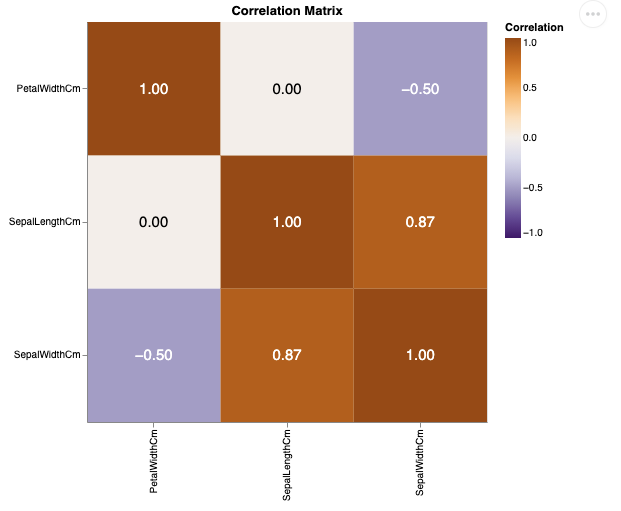

# eda_utils_py 

[](https://github.com/UBC-MDS/eda_utils_py/actions/workflows/build.yml)  [](https://codecov.io/gh/chuangw46/eda_utils_py)  [](https://eda_utils_py.readthedocs.io/en/latest/?badge=latest)

## Overview 

As data rarely comes ready to be used and analyzed for machine learning right away, this package aims to help speed up the process of cleaning and doing initial exploratory data anslysis (EDA). The package focuses on the tasks of dealing with outlier and missing values, scaling and correlation visualization.

## Installation

```bash
$ pip install -i https://test.pypi.org/simple/ eda_utils_py
```

## Functions

The four functions contained in this package are as follows:
- `cor_map`: A function to plot a correlation matrix of numeric columns in the dataframe
- `outlier_identifier`: A function to identify and deal with outliers
- `scale` A function to scale numerical values in the dataset
- `imputer`: A function to impute missing values


## Our Place in the Python Ecosystem

While Python packages with similar functionalities exist, this package aims to simplify the amount of code necessary for these functions and outputs. Packages with similar functionality are as follows:

- [Sklearn.preprocessing]( https://scikit-learn.org/stable/modules/preprocessing.html)
- [Altair Heatmap](https://altair-viz.github.io/gallery/layered_heatmap_text.html)

## Dependencies

- TBD

## Usage
The eda_utils_py package help you to build exploratory data analysis.

eda_utils_py includes multiple custom functions to perform initial exploratory analysis on any input data describing the structure and the relationships present in the data. The generated output can be obtained in both object and graphical form. 

```python
import pandas as pd
from eda_utils_py import eda_utils_py

data = pd.DataFrame({
         'SepalLengthCm':[5.1, 4.9, 4.7],
         'SepalWidthCm':[1.4, 1.4, 1.3],
         'PetalWidthCm':[0.2, 0.1, 0.2],
         'Species':['Iris-setosa','Iris-virginica', 'Iris-germanica']
         })
```

The eda_utils_py will help you to:
- Diagnose data quality: Resolve skewed data by identifing missing data and outlier and provide corresponding remedy.


- This package can help you easily plot a correlation matrix along with its values to help explore data.

```python
numerical_columns = ['SepalLengthCm','SepalWidthCm','PetalWidthCm']

cor_map(data, numerical_columns, col_scheme = 'purpleorange')

```
Output:



- Machine learning pereperation: Perform column transformations, derive scaler automatically to fulfill further machine learning need
    
## Documentation

The official documentation is hosted on Read the Docs: https://eda_utils_py.readthedocs.io/en/latest/

## Contributors

This package is authored by Chuang Wang, Fatime Selimi, Jiacheng Wang, and Micah Kwok as part of the course project in DSCI-524 (UBC-MDS program). You can see the list of all contributors in the [contributors tab](https://github.com/UBC-MDS/eda_utils_py/graphs/contributors).

We welcome and recognize all contributions. If you wish to participate, please review our [contributing guidelines](https://github.com/UBC-MDS/eda_utils_py/blob/main/CONTRIBUTING.rst). 

### Credits

This package was created with Cookiecutter and the UBC-MDS/cookiecutter-ubc-mds project template, modified from the [pyOpenSci/cookiecutter-pyopensci](https://github.com/pyOpenSci/cookiecutter-pyopensci) project template and the [audreyr/cookiecutter-pypackage](https://github.com/audreyr/cookiecutter-pypackage).
